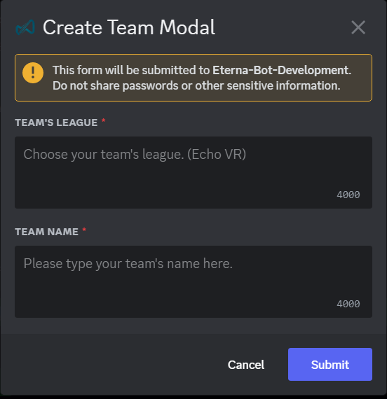
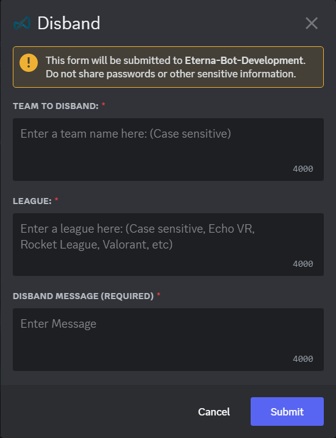

# Eterna Bot Docs

Welcome to the docs for the Eterna-Bot from the Eternaments server! Take a look around by using the chapter view icon in the top left of the README preview. 

## Basic Commands

`/calendar`: Displays the currently set calendar for the year. Outlines tournament kickoffs, finals, and so forth.

`/staff`: Shows the staff page for all of us who work at Eternaments. Use this if you're looking for someone specific from a certain department!

`/showteam [teamname: ]`: Fill in the `teamname` attribute with the team page that you'd like to display, such as ("Tech and Design").

## Personal Commands
### These commands are meant for managing and viewing your own profile and other user's profiles.

`/createplayerprofile`: You must fill out the following form to create a profile. Don't worry, this won't be permanent! You can change this at any time with the following command. ***A PROFILE IS REQUIRED FOR MULTIPLE OTHER COMMANDS***.

 
 

`/editplayerprofile`: Edit your current player profile registered with Eternaments. This command uses the same form as the one pictured above.

`/etplayer [user]`: Displays the mentioned user's profile within the active channel.

## Team Commands
### These commands are meant for team members and their captains. Keep note, some commands require captiancy to execute.

`/createteam`:Creates a team for the specified league. League name is case-sensitive.
 

 

`/disbandteam`: Disbands a team of your choosing. You MUST be the captain of a team to disband it.

 

